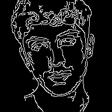
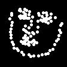

# AvatarPose

This project uses Machine Learning + zero-knowledge proofs to create NFTs for users. It uses pose estimation to detect human poses in the uploaded video. These poses can then be used to animate an SVG avatar.

This approach to NFT generation aims to create NFTs from “lived experiences.” We choose to call these experiential NFTs.

## How it Works

1. We send video frames(images) to the Cartesi machine for edge detection. By doing this, we reduce the image to only 2 colors: black and white. Additionally, this step effectively reduces images size in **number format** - black background means 0 color, hence significant size reduction (~3) in RGB array size.

2. We use [ezkl](https://app.ezkl.xyz/) to run our face landmark detection model `network.onnx` on the image `input.json`. Ezkl produces a `proof.json` file that contains the detected facial features and a zk proof.

```sh
# creates settings.json 
gen-settings 

# genearates compiled model
compile-circuit

# generates witness
gen-witness 

# generates vk and pk
setup

# generates proof.json
prove
```

3. We send this proof + input data to the Cartesi machine. If verified, we can then mint an NFT for the user with the poses.

You maybe wondering what the output is ( i.e. what the NFT is). Here's a description that should help:

The end deliverable is an **experiential gif/video** from the NFT metadata. That is:

- The NFT: **gif/video animation** (created on the browser canvas)

- The NFT metadata: facial landmarks, SVG avatar, video used to generate the landmarks

## How does the NFT look like?

1. First, we extract frames (images) from the video (<5s). 


2. We then apply edge detection to them from the Cartesi machine. 



3. We then convert the image (`image2json.py`) to numerical data for our `input.json`. This data is the input for our compiled model.

**Note:** Ezkl can accept multiples inputs for a single proof generation. Hence, instead of sending 1 video frame, we can use 10 frames(images). For a 3s video with 10fps, we would need 3 proofs for our NFT.

4. After compiling the model, generating a witness, doing the setup ceremony and proving, we get a `proof.json` that contains that contains the detected facial landmarks in `rescaled_outputs` field. We extract this data and save it to later mint our NFT. 



5. The app then sends the proof + input data to the Cooprocessor for verification. We use the npm `@ezkljs/verify` library to verify. After verification, we can mint a NFT.

why prove from Cartesi:

- [Cost](https://risczero.com/blog/on-chain-verification).
- We're verifying on Cartesi and not a L1 because of proof size. We're dealing with proofs of about ~1MB. 

6. The NFT is a **gif/video** animation that uses the detected poses. The animation is created by moving an SVG image (avatar) using the poses. Here's a example [web2 ML application](https://scroobly.com/) that uses detectd poses to move an SVG character (what you see here is how the NFT will look like).