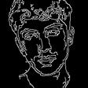

# AvatarPose

This project uses Machine Learning + zero-knowledge proofs to create NFTs for users. It uses [face landmark detection](https://ai.google.dev/edge/mediapipe/solutions/vision/face_landmarker) to detect facial features in the uploaded video. These poses can then be used to animate an SVG avatar. 

This approach to NFT generation aims to create NFTs from “lived experiences.” We choose to call these experiential NFTs. 

## Benefits

Let's explore the benefits of this novel approach:

- **Value derivation.** Our NFT objects have a legitimate claim from where they derive value (unlike most of the stuff on the market now).  This is the key **value proposition** for this project.  
    
  If you know that an animation uses poses based on a recording of Vitalik, then you'll definitely be interested.   
    
  *“Using poses of a certain individual for your avatar allows you to share in their experience.”*

- **Market differentiation.** This approach is unique and brings much-needed innovation to the NFT space.

## How it Works 

1\. A user logs into the platform using a social login \- we use a **wallet abstraction** service (Web3Auth). 

The user uploads a video (< 5s) to the DApp frontend.   
    
2\. The [ezkl](https://app.ezkl.xyz) backend receives the video frames and processes them to detect human facial landmarks. We use ezkl to run our face landmark detection model `network.onnx` on the image `input.json`. Ezkl produces a `proof.json` file that contains the detected facial features and a zk proof.
   
```
# creates settings.json 
gen-settings 

# generates compiled model
compile-circuit

# generates witness
gen-witness 

# generates vk and pk
setup

# generates proof.json
prove
```
3\. Our dapp backend then stores the following NFT metadata on IPFS:

- `facial landmarks`   
- `svg`  
- `original video` (optionally encrypted before storage)  
- Some extra info e.g. name of NFT 

Now, we mint the experiential NFT and then send our data to [NFT.Storage](https://app.nft.storage/v1/docs/intro) for enduring preservation. **NFT.Storage** is a Filecoin service specifically designed for the long-term preservation of NFT data with a one-time payment ($2.99 per GB).

This service requires us to upload a CSV that contains a list of token IDs and CIDs for our NFTs. 

4\.  At the frontend, a user queries the detected `facial landmarks` plus `svg` avatar and uses these to generate an animation (**gif** or **video**). They can then list (or show off\!)  this animation on an NFT marketplace.

**Notes:** 

From the description above, you maybe wondering what the output is ( ie. what the NFT is). Here's a description that should help:

The end deliverable is an **experiential gif/video** from the NFT metadata. That is:

* The NFT: **gif/video** animation (created on the browser canvas)

* The NFT metadata: facial landmarks, SVG avatar, video used to generate the landmarks

## How does the NFT look like?

1. First, we extract frames (images) from the video (<5s). 


2. We then apply edge detection and bit quantization to the frames



3. We then convert the image (`image2json.py`) to numerical data for our `input.json`. This data is the input for our compiled model.

**Note:** Ezkl can accept multiples inputs for a single proof generation. Hence, instead of sending 1 video frame, we can use 10 frames(images). For a 3s video with 10fps, we would need 3 proofs for our NFT.

4. After compiling the model, generating a witness, doing the setup ceremony and proving, we get a `proof.json` that contains that contains the detected facial landmarks in `rescaled_outputs` field. We extract this data and save it to later mint our NFT. 


5. The app then sends the proof + input data to the blockchain for verification. We use the `Halo2Verifier` contract. After verification, we can mint a NFT.

6. The NFT is a **gif/video** animation that uses the detected facial landmarks. The animation is created by moving an SVG image (avatar) using the facial landmarks. 

Here's a demo that uses detected poses to move an SVG character.

https://github.com/user-attachments/assets/2bcf4cea-85b1-4c61-a2d9-be683bd75a40


## Use cases

- Famous individuals can create NFT poses and list them. Users can then buy them and choose an SVG avatar for these poses. This allows for personalization on the side of buyers    
- Ordinary individuals can also generate NFTs from captivating moments of their life 

## Future developments

To be done after the initial product launch:

- Pose estimation for non-human motion e.g. for dogs and cats    
- Fractionalization. Given that our videos generate an array of pose objects, we can have each “pose moment” (video frame or second) as an NFT     

## References

1. [Pose estimation](https://www.tensorflow.org/lite/examples/pose_estimation/overview)    
2. [Pose Animator by Shan Huang](https://github.com/yemount/pose-animator)     
3. [Dog Pose estimation](https://github.com/ryanloney/dog-pose-estimation) 
